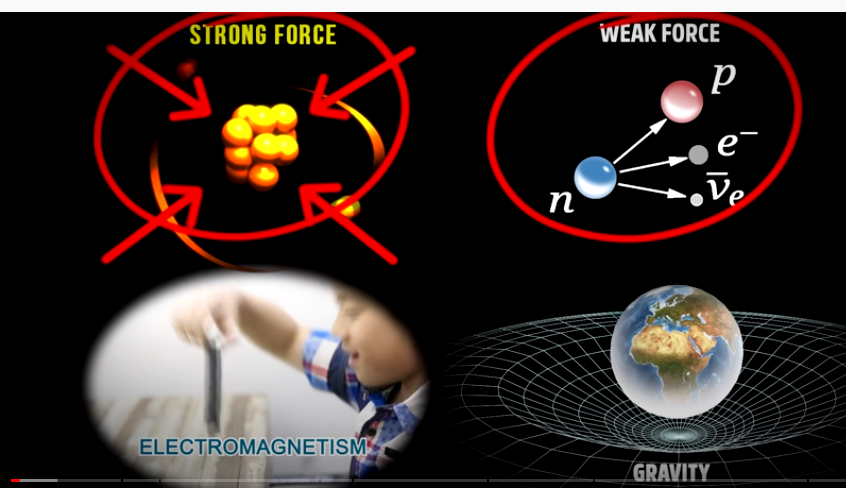
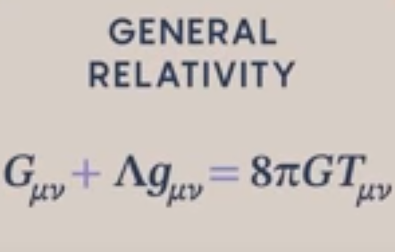

## THE 4 FUNDAMENTALS INTERACTIONS (FORCES)

Electromagnetic force, strong nuclear force,  weak nuclear force, gravity
Each has an associated particle

Mediated by force-carrier particles (bosons)
    
## ELECTROMAGNETIC FORCE

Its force carrier is the photon (light waves are made of photons)
Governs light, electric and magnetic phenomena, chemical properties
Act on electrically charged particles (electrons, quarks but not neutrinos)
Bonds that link matter constituents are based on the EMF force
Attract particles of unlike electrical charge 
Repel particles of like electrical charge 
Bind atoms, hold electrons within the shells surrounding the nucleus

## STRONG NUCLEAR FORCE (COLOUR FORCE)

Its force carrier is the gluon because it sticks quarks together

Acts only on subatomic level (on subatomic distances), only on quarks (subsequently on protons, neutrons)
Link nucleus components together (energy released by fission)
Bind quarks particles together to form protons, neutrons and atomic nuclei
Control the quarks "colour" porperty and as it operates the quarks constantly change "colour" by exhanging virtual gluons (force carrier particles)

A quark sitting in space give rise to a "gluon field" that doesn't radiate (as an electron does)
A quark produce a thin flux tube ~ string that only end when it find another type of quark
These tube create a "confinement": we can't see quarks on their own, they are bound into protons

## WEAK NUCLEAR FORCE

Its force carrier are W+ W- and Z0 bosons

Acts only on subatomic distances
The only force to act on all the particles (in particular the only once neutrinos feel)

About decay, allow quarks to switch their identity, ex:
    Radioactive beta decay: a down quark switch to up into a neutron
        Neutron (2d, 1u) → Proton (2u, 1d) + electron + neutrino
Responsible for the nuclear fusion (sun)
Control a variety of nuclear interactions (radioactive decay…)
Reason that heavier matter particles (muon, strange...) quickly decay into the three lighter and more stable fermions

## GRAVITY

No effect at subatomic level
Don't know how to include it into standard model
?? Gravitational waves (made of graviton particles) = ripples of space and time ??

## Grand unified theory

The 3 forces are a manifestation of a single encompassing force
