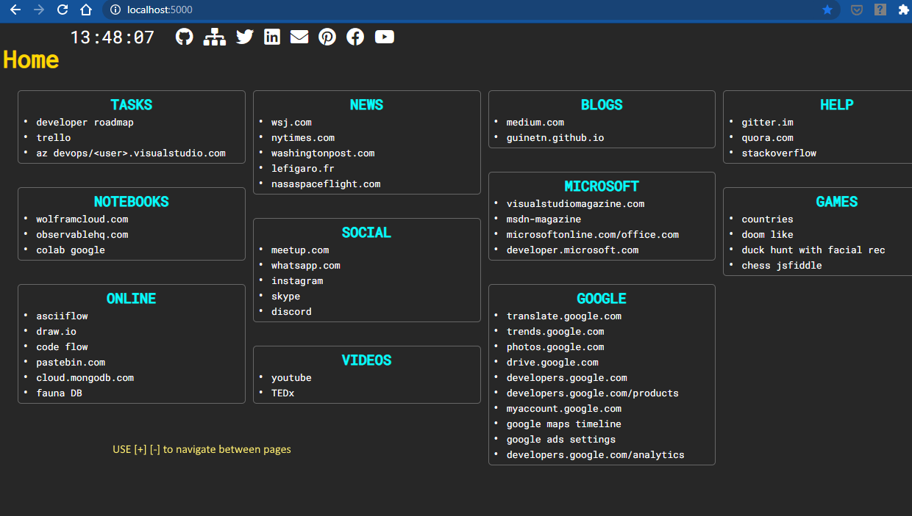

# Browser Local Homepage

A custom homepage for use locally in your browser as a tool 
Include many pages having links, tools (B64, Timestamp)  

### Navigation 
- [+] [-] 
- First letter of the name of the page you want to navigate to [h]omepage [w]eb [c]ode…

# Configuration

Add your own pages, links...

### pages

* Pages are defined in index.html

* Basic
>

>add content here 
>

* Related to links in links.json
>
" class="view">
>  <h1>a name for my topic</h1>  
>
>  
  
>    

  <mark>vlinks_xxx or hlinks_xxx are defined in links.json</mark>      
>    

        
>    

        
>  

>
>

>links.json
* vlinks_<my_topic>  for vertical links list
* links_<my_topic>   for horizontal links list

* Then links_<my_topic> is placed as a placeholder in index.html
>	"vlinks_help": [
>		{ "name": "gitter", "ref": "https://gitter.im" },
>		{ "name": "quora", "ref": "https://www.quora.com" },
>		{ "name": "stackoverflow", "ref":"https://stackoverflow.com" }
>		],	

# Development

>cd <my_folder>
>serve   	(npm i -g serve)

>or live-server from vs code…

# How to use

Host it for free as a github page  

>chrome::settings
>Appearance
>Welcome button
>Set your repo <cite><you>.github.io/browserLocalHomepage</cite> as you're browser homepage

